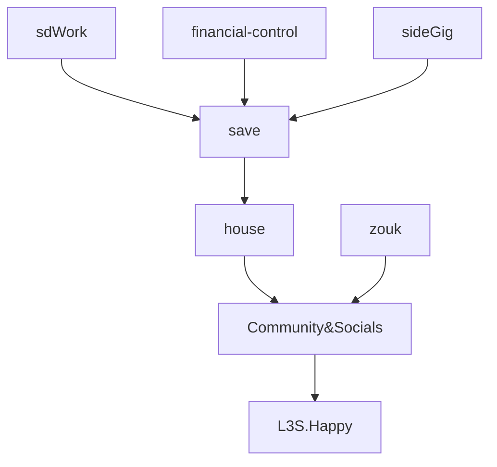

----




## sideGig: +$2K/m → $2K/m 
```
prepare website. 
im a data ace. 
something frustrating, monotonous, cumbersome -- preventing you from billing more? call me.
```

I want to support businesses that are already making money but could make more money if they work smarter
arbitrage --> my strength = their weakness (data, organization, experience) 
their growth --> my paycheck
NOT ON CALL -- schedule consults; video messages; tutorials; 
I'm persistent due to 1) scarcity; 2) extra-capacity

STORY
meet clients in NYC.
sketch plan for fun. xchk w models. 
import tools and libraries; 

AI.xchk -- if it has any recommendations? things i missed? modify and update. 
map and build definitions based on client-specific notes and assets uploaded. 
assess the level of mapping. recm concrete steps for cleaninf any maps. develop proposals. price strategy.


### Financial Control
- How much do I have currently? 
- How much surplus (or deficit)? 
- first need to know minimum / budget? 
- How much flowed into savings? 
- 
House.Kitchen
- clean at night non-disruptive morning
	- dishwasher before dance
	- open at night to dry
	- restock (oils)
	- towel tied
- eat more fish

House.Plants
- reduce fussing → automate to travel 
	- every 3 days
	- weekly; 
	- biweekly -- succulents
	- auto-sprinklers

