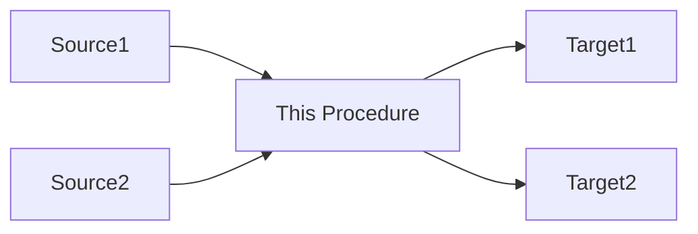

# Model Context Protocol (MCP) Optimization Guide

**Created**: 2026-01-05  
**Owner**: Analytics Team  
**Status**: Recommendation

---
## VISION

Create a robust Model Context Protocol that enables LLMs to:
1. Parse vague business questions
2. Resolve terminology through aliases and concept maps
3. Navigate hierarchical documentation to find data sources
4. Generate accurate SQL queries or Power BI solutions
5. Provide clarifying questions when needed

### Example Flow
**Business Question**: "Compare Starts From Start Needed in 2024 vs 2025; Since Smile Doctors has grown and now we're doing more adults with Smile Express, I want to know if our recapture incentives need to be re-structured"

**MCP Resolution**:
- Identify Output Types → [[Types - Case Starts]]
- Resolve aliases → "Start Needed" = [[Start Needed %]]
- Navigate concepts → [[Concepts - Contracts]]
- Find data sources → [[EDW.sd.Contracts]]
- Apply filters → Smile Express segment
- Generate query or dashboard spec

---
## ENHANCED FOLDER STRUCTURE

```
├── 00 - MOC/                          # Master Maps of Content
│   ├── _Master Index.md
│   ├── Concepts Map.md
│   ├── Types Map.md
│   ├── Measures Map.md
│   └── Data Architecture Map.md
│
├── 01 - Projects/                     # (existing)
│
├── 02 - Dictionary/                   # (existing) Business terminology
│   ├── __Map - Business Concepts.md
│   ├── _Abbreviations.md              # don't bother with this
│   ├── _Tables.md
│   └── [term definitions]
│
├── 03 - Measures/                     # (existing) KPIs & Metrics
│   ├── _MOC Measures.md
│   └── [measure definitions]
│
├── 04 - Database Objects/             # Enhanced structure
│   ├── _MOC Tables.md
│   ├── _MOC Views.md
│   ├── Tables/
│   │   ├── by Database/
│   │   │   ├── CentralC9/
│   │   │   ├── EDW/
│   │   │   └── Lake/
│   │   └── by Domain/
│   │       ├── Patients/
│   │       ├── Contracts/
│   │       ├── Appointments/
│   │       └── Financials/
│   ├── Views/
│   └── Columns/                       # NEW: Column-level docs
│       └── [Table].Columns.md
│
├── 05 - Procedures/                   # NEW: Stored procedure docs
│   ├── _MOC Procedures.md
│   ├── _Execution Schedule.md
│   ├── by Database/
│   │   ├── CentralC9/
│   │   ├── EDW/
│   │   └── Lake/
│   └── by Function/
│       ├── ETL-Sync/
│       ├── Aggregation/
│       └── Reporting/
│
├── 06 - Lineage/                      # NEW: Data flow documentation
│   ├── _Master Lineage Map.md
│   ├── Patient Flow.md
│   ├── Contract Flow.md
│   ├── Financial Flow.md
│   └── Dependencies/
│       ├── Forward-Dependencies.md    # What this affects
│       └── Backward-Dependencies.md   # What affects this
│
├── 07 - Business Questions/           # NEW: Common analytical patterns
│   ├── _MOC Common Questions.md
│   ├── Starts Analysis/
│   ├── Conversion Analysis/
│   └── Templates/
│       └── Question-Answer-Template.md
│
├── 08 - Concepts/                     # Reorganize existing Concepts
│   ├── Concepts.md (MOC)
│   ├── Concepts - Patients.md
│   ├── Concepts - Contracts.md
│   └── [other concepts]
│
├── 09 - Types/                        # Reorganize existing Types
│   ├── Types.md (MOC)
│   ├── Types - Contracts.md
│   └── [other types]
│
└── 10 - Reference/                    # (existing as 04 - Reference)
    ├── Servers/
    ├── Teams/
    └── Vendors/
```

---

## YAML FRONTMATTER STANDARD

Every file should have:

```yaml
---
aliases: [Alternate Name 1, Abbrev, Common Term]
tags: 
  - category/subcategory
  - domain/area
  - object-type
related_concepts: [Concept1, Concept2]
related_types: [Type1, Type2]
data_objects: [Table1, Table2]
measures: [Measure1, Measure2]
last_updated: YYYY-MM-DD
owner: Team or Person
---
```

This enables:
- Fuzzy matching on aliases
- Tag-based semantic search
- Relationship graph traversal
- Automatic cross-referencing

---

## OPTIMIZED STANDARD TEMPLATES

### 1. Table/View Documentation Template

```markdown
---
aliases: [alternate names, common abbreviations]
tags: [database/table, core/dimension/fact, domain-area]
object_type: table|view|procedure
database: DatabaseName
schema: SchemaName
qualified_name: Database.Schema.Object
last_updated: YYYY-MM-DD
---

# [Database].[Schema].[ObjectName]

## Overview
**Purpose**: Brief 1-2 sentence description of what this object represents
**Object Type**: Table | View | Stored Procedure
**Row Count**: ~X million (as of date)
**Update Frequency**: Real-time | Daily | Weekly | Monthly

## Business Context
**Domain**: Patients | Contracts | Appointments | Financials | Employees
**Used For**: 
- Primary use case 1
- Primary use case 2

**Related Concepts**: [[Concept Link 1]], [[Concept Link 2]]
**Related Types**: [[Types - X]], [[Types - Y]]

## Schema

| Column | Data Type | Nullable | Description | Business Rules | Sample Values |
|--------|-----------|----------|-------------|----------------|---------------|
| ColumnName | varchar(50) | NOT NULL | Description | Validation rules | 'value1', 'value2' |

## Key Relationships

### Parent Tables (FK → PK)
- [[ParentTable]].ParentKey → ThisTable.ForeignKey

### Child Tables (PK → FK)  
- ThisTable.PrimaryKey → [[ChildTable]].ForeignKey

### Bridge/Junction Tables
- [[BridgeTable]] connects to [[OtherTable]]

## Common Query Patterns

```sql
-- Pattern 1: Most common usage
SELECT ...
FROM [Database].[Schema].[ObjectName]
WHERE ...

-- Pattern 2: Join with related tables
SELECT ...
FROM [Database].[Schema].[ObjectName] t
  INNER JOIN [[RelatedTable]] r ON ...
```

# 2. Stored Procedure Documentation Template
```


```markdown
---
aliases: [short names]
tags: [database/procedure, etl/transform/sync, domain-area]
object_type: procedure
database: DatabaseName
schema: SchemaName
qualified_name: Database.Schema.ProcedureName
schedule: Daily 2am | Real-time | On-demand
last_updated: YYYY-MM-DD
---

# [Database].[Schema].[ProcedureName]

## Overview
**Purpose**: What this procedure does in business terms
**Execution**: Scheduled | Triggered | Manual
**Schedule**: Daily at 2:00 AM UTC | Real-time | etc.
**Run Time**: ~X minutes average
**Dependencies**: Requires [[Proc1]], [[Proc2]] to complete first

## Parameters

| Parameter | Type | Required | Default | Description |
|-----------|------|----------|---------|-------------|
| @param1 | INT | Yes | NULL | Description |
| @param2 | VARCHAR(50) | No | 'default' | Description |

## What It Does

### Business Logic
1. Step 1 description
2. Step 2 description
3. Final outcome

### Technical Process
- **Source**: Reads from [[SourceTable1]], [[SourceTable2]]
- **Transformation**: Merges/Aggregates/Calculates X
- **Target**: Updates [[TargetTable1]], [[TargetTable2]]
- **Operation**: MERGE | INSERT | UPDATE | DELETE

## Target Objects & Columns Modified

### [[TargetTable1]]
- `Column1` - How it's populated
- `Column2` - Calculation logic
- `Column3` - Source mapping

### [[TargetTable2]]
- `ColumnA` - Description
- `ColumnB` - Description

## Dependencies

### Upstream (Reads From)
- [[Table1]] - What data is read
- [[Table2]] - What data is read
- [[Procedure1]] - Must run before this

### Downstream (Affects)
- [[Table3]] - What gets written
- [[Procedure2]] - Runs after this
- [[Dashboard - Name]] - What reports use this data

## Data Flow Diagram



## Error Handling
- What happens on failure
- Retry logic
- Alerts/Notifications

## Performance Notes
- Processes ~X million rows
- Typical duration: X minutes
- Indexes used: List key indexes

## Related
**Concepts**: [[Concept - X]]
**Measures**: [[Measure - Y]]
**Known Issues**: [[Types - Known Issues#Issue Name]]

## Sample Execution

```sql
EXEC [Database].[Schema].[ProcedureName]
    @param1 = value,
    @param2 = value;
```

## Change History
- YYYY-MM-DD: Added logic for X
- YYYY-MM-DD: Fixed issue with Y

---
## Data Lineage

### Source Systems
- **CentralC9** (Cloud9 PMS)
- **OrthoFi** (Financial system)
- **Legacy Systems**

### Populated By
- [[Procedure.Name1]] - Daily at 2am
- [[Procedure.Name2]] - Real-time sync

### Feeds Into
- [[DownstreamTable1]]
- [[DownstreamView1]]
- [[Dashboard - Name]]

## Known Issues & Gotchas
- [[Types - Known Issues#Specific Issue]]
- Data quality: Watch for nulls in ColumnX before DateY
- Performance: Always filter on PartitionKey

## Examples & Use Cases

### Use Case 1: [Business Question]
```sql
-- Answer to common business question
```

**Related Measures**: [[Measure - Name]]
**Related Dashboards**: [[Dashboard - Name]]

## Metadata
**Sort Order**: X.XX (for MOC organization)
**Table Type**: core | dimension | fact | bridge | config
**Loaded By**: ETL job name or person
**Load Source**: Source system identifier


```

### 3. Measure/Metric Documentation Template

```markdown
---
aliases: [ACF, AvgCaseFee]
tags: [measure, kpi, domain-area]
calculation_type: count|sum|average|percentage|ratio
granularity: patient|contract|office|month
last_updated: YYYY-MM-DD
---

# [Measure Name]

## Definition
**What It Measures**: Plain English explanation
**Business Significance**: Why this matters
**Used By**: FP&A | Operations | Clinical | Marketing

## Calculation

### Business Formula
```
Measure = Numerator / Denominator
```

### SQL Implementation
```sql
SELECT 
    SUM(ColumnA) / COUNT(ColumnB) AS MeasureName
FROM [[SourceTable]]
WHERE [FilterConditions]
GROUP BY [Dimensions]
```

### DAX Implementation (if applicable)
```dax
MeasureName = 
DIVIDE(
    SUM([ColumnA]),
    COUNT([ColumnB]),
    0
)
```

## Data Sources
- **Primary Table**: [[TableName]]
- **Supporting Tables**: [[Table1]], [[Table2]]
- **Required Filters**: Must filter by X, Y
- **Date Range**: Use [[Stable Month]] for historical

## Dimensions & Filters
**Standard Dimensions**:
- Office / Location
- Date / Month / Year
- Employee / Doctor
- Contract Type

**Common Filters**:
- Exclude pre-conversion (DateKey >= DashboardStartDate)
- Same Store only
- Active contracts only

## Benchmarks & Targets
- **Target**: $X,XXX
- **Industry Benchmark**: $Y,YYY
- **Historical Average**: $Z,ZZZ
- **Threshold Alerts**: < $A,AAA (Red), < $B,BBB (Yellow)

## Related Measures
- **Parent Measure**: [[Broader Measure]]
- **Component Measures**: [[Measure1]], [[Measure2]]
- **Inverse/Complement**: [[Related Measure]]

## Used In
- **Dashboards**: [[Dashboard - Name1]], [[Dashboard - Name2]]
- **Reports**: [[Report - Name]]
- **Alerts**: [[Alert - Name]]

## Business Rules & Exclusions
- Exclude voided contracts
- Include only case starts (IsCaseStart = 1)
- Exclude Phase 1 unless specified
- Filter out test/training offices

## Known Issues
- [[Types - Known Issues#OrthoFi Date Alignment]]
- Data lag: Updates daily at 3am
- Historical data before YYYY-MM-DD may be incomplete

## Variations
### By Contract Type
- **Full Treatment**: Filter for TxPlanGroup = 'Full'
- **Phase 1 Only**: Filter for IsPhase1 = 1
- **Adult (Smile Express)**: Filter for appropriate TxPlan

### By Time Period
- **MTD** (Month-to-Date)
- **YTD** (Year-to-Date)
- **Rolling 12 Months**

## Example Use Cases

### Use Case 1: Compare starts needed YoY
```sql
-- 2024 vs 2025 comparison
SELECT ...
```

**Answer**: Shows X% change, suggests Y action

## Validation & Quality Checks
```sql
-- QA Query to validate calculation
SELECT ...
-- Expected result: ...
```

## Metadata
**Concept**: [[Concepts - Contracts]]
**Type**: [[Types - Output]]
**Owner**: Analytics Team
**Update Frequency**: Daily
```

---

## WHAT'S MISSING FROM CURRENT STRUCTURE

### Critical Additions Needed

#### 1. **05 - Procedures/** folder
Structure stored procedures similar to tables:
```
05 - Procedures/
  _MOC Procedures.md (master list)
  by Database/
    CentralC9/
    EDW/
    Lake/
  by Schedule/
    Daily-ETL.md
    Real-time-Sync.md
```

#### 2. **Data Lineage Files**
Create explicit lineage documentation:
```
06 - Lineage/
  _Lineage Map.md
  Patient Data Flow.md
  Contract Data Flow.md
  Financial Data Flow.md
```

#### 3. **Enhanced MOC Files**
Your MOCs need:
- Hierarchical organization by domain
- Cross-references between concepts/types/measures
- Visual diagrams (Mermaid)

#### 4. **Business Question Templates**
```
07 - Common Questions/
  Starts Analysis.md
  Conversion Analysis.md
  Financial Performance.md
```

#### 5. **Column-Level Metadata** 
Convert your CSV into structured markdown:
```
04 - Database Objects/
  Columns/
    CentralC9.dbo.Patient.Columns.md
```

Format:
```markdown
## patID
- **Type**: INT IDENTITY
- **Nullable**: NOT NULL
- **Description**: Primary key for patients
- **Business Rules**: Auto-generated, unique per SourceSystemId
- **Sample Values**: 12345, 67890
- **Used In Joins**: [[PersonAggregate]].patID
- **Used In Measures**: [[Case Start Count]]
```

#### 6. **Procedure Dependencies Map**
Structured file showing execution order:
```markdown
# Daily ETL Execution Order

## Phase 1: Source Sync (2:00 AM - 2:30 AM)
1. [[CentralC9.sd.usp_Sync_Patient]]
2. [[CentralC9.sd.usp_Sync_Location]]
3. [[CentralC9.sd.usp_Sync_Employee]]

## Phase 2: Aggregation (2:30 AM - 3:00 AM)
1. [[Lake.C9.usp_Aggregate_PersonData]]
2. [[Lake.C9.usp_Aggregate_Appointments]]

## Phase 3: Business Logic (3:00 AM - 4:00 AM)
...
```

#### 7. **Schema Change Log**
```
08 - Change History/
  2025-Q1-Schema-Changes.md
  2024-Q4-Schema-Changes.md
```

---

## MCP QUERY RESOLUTION FLOW

### Example: Resolving Business Question

**Question**: "Compare Starts From Start Needed in 2024 vs 2025; Since Smile Doctors has grown and now we're doing more adults with Smile Express, I want to know if our recapture incentives need to be re-structured"

### Resolution Steps:

1. **Parse Intent**:
   - Metric: "Starts From Start Needed" 
   - Comparison: YoY (2024 vs 2025)
   - Segmentation: Adult/Smile Express
   - Decision: Recapture incentives restructuring

2. **Alias Resolution** → Check `02 - Dictionary/_Abbreviations.md`:
   - "Starts" → Case Starts
   - "Start Needed" → [Start Needed %]
   - "Smile Express" → Adult treatment program

3. **Navigate to Measure** → [[03 - Measures/Start Needed %.md]]:
   - Get calculation formula
   - Identify required tables
   - Understand filters/exclusions

4. **Navigate to Types** → [[Types - Case Starts]]:
   - Understand what qualifies as a case start
   - Get IsCaseStart logic
   - Understand Phase 1 vs Full treatment

5. **Navigate to Concept** → [[Concepts - Contracts]]:
   - Understand business context
   - Get data source: [[EDW.sd.Contracts]]

6. **Navigate to Data Object** → [[04 - Database Objects/EDW.sd.Contracts]]:
   - Get schema
   - Get join patterns
   - See sample queries

7. **Check Lineage** → [[06 - Lineage/Contract Flow.md]]:
   - Verify data freshness
   - Check for known issues
   - Understand OrthoFi vs Cloud9 differences

8. **Apply Segmentation** → [[Types - Contracts#Smile Express]]:
   - Get TxPlan filter for Smile Express
   - Understand adult patient criteria

9. **Generate Query**:
```sql
WITH StartNeeded AS (
  SELECT 
    YEAR(c.DateKey) AS Year,
    CASE WHEN tpk.TxPlanGroup = 'Smile Express' THEN 'Adult/SE' ELSE 'Traditional' END AS Segment,
    -- Calculation from [[Start Needed %]]
    SUM(c.ContractAmount) AS TotalRevenue,
    COUNT(c.ContractKey) AS TotalStarts
  FROM [[EDW.sd.Contracts]] c
    INNER JOIN [[EDW.sd.ContractKeys]] ck ON c.ContractKey = ck.ContractKey
    LEFT JOIN [[Lake.C9.PersonAggregate]] p ON c.PatientKey = p.PatientKey
    LEFT JOIN [[EDW.bi.dim_TxPlanKeys]] tpk ON c.TxPlanKey = tpk.TxPlanKey
  WHERE c.IsCaseStart = 1
    AND c.DateKey >= '2024-01-01'
    AND c.DateKey < '2026-01-01'
    AND c.IsPreConversion = 0  -- From [[Stable Month]]
  GROUP BY YEAR(c.DateKey), tpk.TxPlanGroup
)
SELECT 
  Year,
  Segment,
  TotalStarts,
  TotalRevenue,
  TotalRevenue / NULLIF(TotalStarts, 0) AS AvgCaseFee
FROM StartNeeded
ORDER BY Year, Segment;
```

10. **Validate & Clarify** (if needed):
    - "Do you want Same Store offices only?"
    - "Should we exclude Phase 1?"
    - "Any specific regions/divisions?"

---

## IMPLEMENTATION PRIORITY

### Phase 1: Foundation (Week 1-2)
1. ✅ Standardize existing table docs using new template
2. ✅ Add YAML frontmatter with aliases to all files
3. ✅ Create column-level metadata files for top 20 core tables
4. ✅ Build procedure documentation folder structure

### Phase 2: Connectivity (Week 3-4)
1. ✅ Document forward/backward dependencies
2. ✅ Create lineage flow diagrams
3. ✅ Build MOC master index with hierarchical links
4. ✅ Add "Related" sections to all existing docs

### Phase 3: Intelligence (Week 5-6)
1. ✅ Create business question templates
2. ✅ Document common query patterns
3. ✅ Add sample answers to frequent questions
4. ✅ Build validation queries for measures

### Phase 4: Automation (Week 7-8)
1. ✅ Script to generate table docs from metadata CSV
2. ✅ Script to generate procedure docs from dependency CSV
3. ✅ Auto-generate column documentation
4. ✅ Build graph database of relationships

---

## AUTOMATION SCRIPTS NEEDED

### 1. CSV to Markdown Converter (Tables)
```python
# Convert table metadata CSV to markdown files
# Input: table_metadata.csv
# Output: 04 - Database Objects/Tables/[Database]/[Schema].[Table].md
```

### 2. CSV to Markdown Converter (Procedures)
```python
# Convert procedure dependency CSV to markdown files
# Input: procedure_dependencies.csv
# Output: 05 - Procedures/[Database]/[Schema].[Procedure].md
```

### 3. Dependency Graph Builder
```python
# Build networkx graph from dependencies
# Generate Mermaid diagrams for lineage
# Create forward/backward dependency lists
```

### 4. Link Validator
```python
# Scan all .md files
# Validate [[WikiLinks]]
# Report broken links
# Suggest corrections based on fuzzy matching
```

---

## KEY PRINCIPLES

### 1. Atomic & Human-Friendly
- Each file covers ONE concept/object/measure
- Plain language descriptions first, technical details second
- Examples and use cases in every file

### 2. Complete & Unambiguous
- Include all aliases and alternative names
- Document edge cases and exclusions
- Link to known issues and gotchas

### 3. Interconnected
- Every file links to related concepts/types/measures
- Bidirectional navigation (parents and children)
- Visual diagrams for complex relationships

### 4. LLM-Traversable
- Structured YAML frontmatter for programmatic parsing
- Consistent templates across all object types
- Clear hierarchy in MOCs and folder structure

### 5. Version-Controlled
- Document change history
- Track schema evolution
- Note deprecated fields/objects

---

## SUCCESS METRICS

### MCP Effectiveness
- **Query Resolution Rate**: % of business questions that can be answered without human intervention
- **Clarification Rate**: % of questions requiring follow-up (target: <20%)
- **Accuracy**: % of generated queries that return correct results
- **Coverage**: % of database objects documented

### Documentation Quality
- **Link Integrity**: % of working internal links (target: >95%)
- **Freshness**: % of docs updated in last 90 days
- **Completeness**: % of required template sections filled
- **Examples**: % of objects with working code samples

---

## NEXT STEPS

1. **Generate Sample Files** using CSV data for:
   - Top 20 core tables
   - Top 10 ETL procedures
   - Key measures (Start Needed %, ACF, etc.)

2. **Create Automation Scripts** to:
   - Convert CSV metadata to markdown
   - Generate lineage diagrams
   - Validate links across vault

3. **Build Specific Templates** for:
   - Column-level documentation
   - Business question templates
   - Lineage flow documents

4. **Design Graph Schema** for:
   - Table→Column relationships
   - Procedure→Table dependencies
   - Measure→Data Source mappings
   - Concept→Implementation links

---

## APPENDIX: Current Data Assets

### Available Metadata
- **Table/View Schema**: ~1000+ objects with columns, types, row counts
- **Procedure Dependencies**: Forward dependencies showing what each proc modifies
- **Dependency Map**: Starting to build table→column relationships
- **Business Documentation**: Concepts, Types, Dictionary terms in Obsidian

### Gaps to Fill
- Procedure parameter documentation
- Column-level descriptions and business rules
- Backward dependencies (what reads from each table)
- Sample data and value ranges
- Query performance characteristics
- ETL execution schedules and durations
