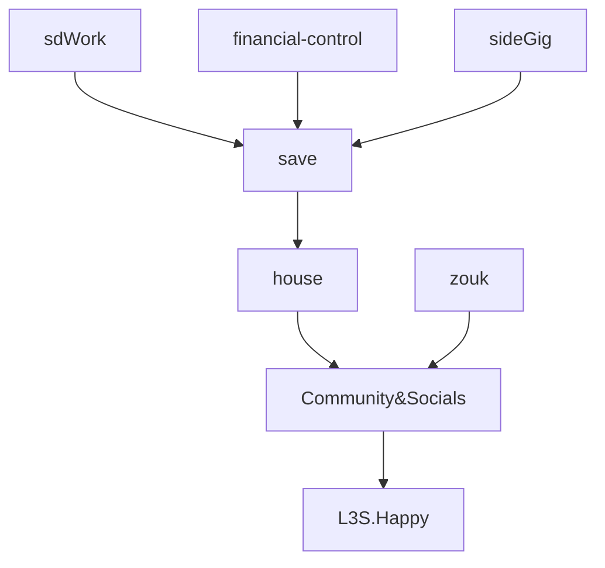

1. decide precise requirements to call tax-client
	- meet pre-reqs to confidently call
2. optimize note flow -- too much junk again --> [[01 - Projects/readme|readme]]
	- more skilled w obsidian -- keeping notes atomic; linked

- use obsidian as my crm for moving projects atomically
- keep is mobile but → to `obsidian.hub` or `obsidian.project`

### New Tools
- #powershell "a" -ceq "b"

#quick-paste-merge-later 
```
  problem statement
  problem type; subtype; bi request types. 
     areas of business. problem areas. 
  import maps from client library. abbrev. dfn. 
     loop through all related dpn. get. 
  import tools from tool library - front/back. 

---
DATA-CANVAS
give jenny ability to paint w poulation snapshot 
agg-patient-status-snap

----
Tax-Support

day job is dashboards for finance. 
i also do consulting + full stack developer but client passed away. 

built a custom call work queue. call log app and dashboards. cost $6K when done w his custom logic. but I have an out-of-the-box solution for $2K. 

he also has an apptms dashboard. see his trends and optimize his schedule. 

$20K total bc the data and business logic had to be built from scratch. but if your team can fill data in the template. you can have a dash to see yoy performance. sms text to you / leaders. bi-alarms. $200 setup. 
```

## Finance Arc
[$6022.20]
- $2308.44 DEC23
+ $2500 DEC25
[$6214.76]
- $1300 JAN01 (Rent)
[$4897.26]
+ $2500 jan 8


----




## sideGig: +$2K/m → $2K/m 
```
prepare website. 
im a data ace. 
something frustrating, monotonous, cumbersome -- preventing you from billing more? call me.
```

I want to support businesses that are already making money but could make more money if they work smarter
arbitrage --> my strength = their weakness (data, organization, experience) 
their growth --> my paycheck
NOT ON CALL -- schedule consults; video messages; tutorials; 
I'm persistent due to 1) scarcity; 2) extra-capacity

STORY
meet clients in NYC.
sketch plan for fun. xchk w models. 
import tools and libraries; 

AI.xchk -- if it has any recommendations? things i missed? modify and update. 
map and build definitions based on client-specific notes and assets uploaded. 
assess the level of mapping. recm concrete steps for cleaninf any maps. develop proposals. price strategy.
#### Goals
1 interview / week -- Senior BI
3 entrepreneur calls a week
1 workout
1 event / 2 weeks -- Local Asheville
* tax
* dentists
* credit unions
* we work; up work

#### Schedule
- **Tue**-**Thur**-Sat-Sun: 2hrs night (05PM-07PM)
- Mon-**Tue**-Wed-**Thur**: 2hrs day (10AM-11AM, 01PM-02PM)
- No Work Friday
- 4 days, 4 hrs

#### Projects
- ttownsend scraper
- 


### Financial Control
- How much do I have currently? 
- How much surplus (or deficit)? 
- first need to know minimum / budget? 
- How much flowed into savings? 
- 
House.Kitchen
- clean at night non-disruptive morning
	- dishwasher before dance
	- open at night to dry
	- restock (oils)
	- towel tied
- eat more fish

House.Plants
- reduce fussing → automate to travel 
	- every 3 days
	- weekly; 
	- biweekly -- succulents
	- auto-sprinklers

