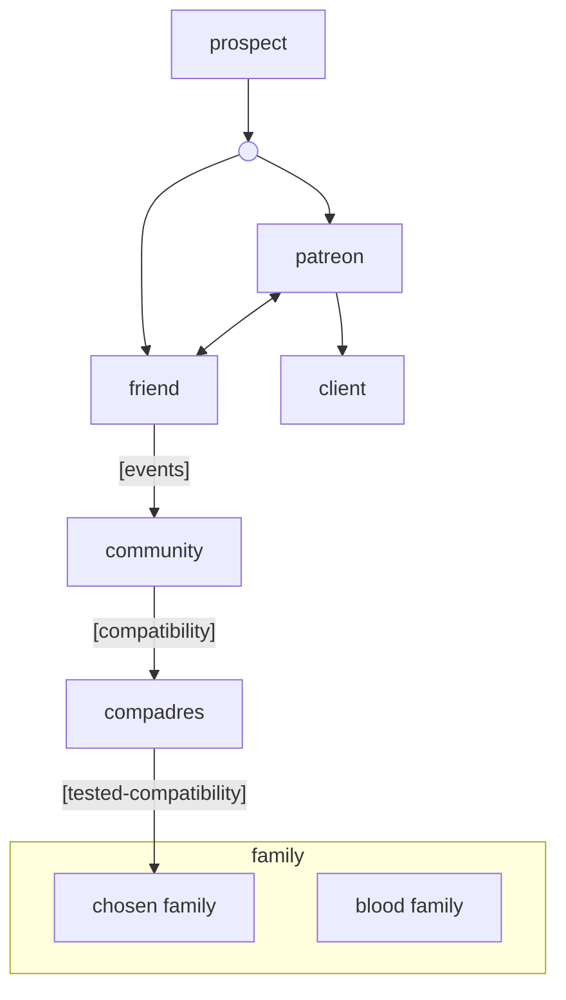

$10-$20/mo for every 

**compatibility gradient**
* shared values -- integrity, logic, abundance mindset, growth
* x-factor -- neutral events, intimate events

community -- potluck, movie nights, dance events, themes
flying, meeting someone and say hi! what do you get into? 

I'm always looking for different ideas of what inspires people or what they like to do? 
I personally love dancing -- private IG of my dances; travels; family; 

|     | Rosa; Jezelle; Lorraine; Perry; Mom; Dad; Mark |
| --- | ---------------------------------------------- |
|     | Ale; Peter                                     |
|     | Imad; Monica; Gabrielle                        |
|     | Katy; Mark;                                    |
|     | Kalissa; Kassy; Dominic                        |

# Asheville
|     | Danielle; Kamran             |
| --- | ---------------------------- |
|     | Whitney; Liz; Ashley; Alllie |
|     |                              |

# Fab 5 Project

| Doctor    |     |
| --------- | --- |
| Lawyer    |     |
| Handyman  |     |
| Carpenter |     |
| Mechanic  |     |
