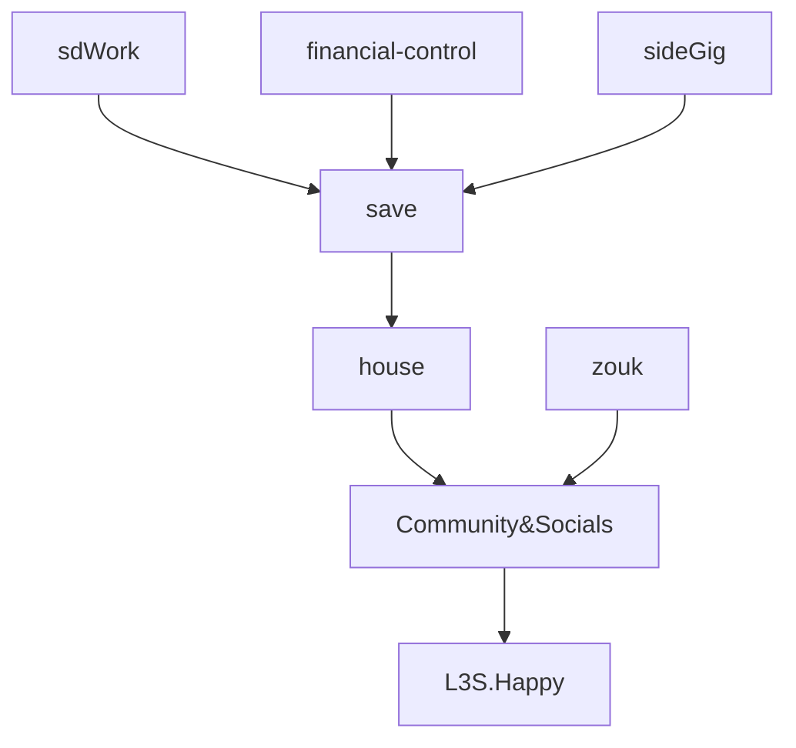

Updated: 2026-03-01 07:33 PM


From $5K → $7K/month (+$2K)
- [[_Umbrella#Networking Fields|networking]] → artemis-bi.com (storefront, portfolio) → project starts
	- solutions: forms, websites, apps, scrapers
	- not on call! sprints, warranty, then off --> secretary triage
	- friends: $10/$20 month subscription -- keep-me-honest app? 
- cold calls (tax doc scraper) → 
- taste → design, ideas, shortest time to value (STTV)

Don't die poor (even if loved) → independent

Freedom of Travel + Experiences in Leftover Prime

Premium Benefits
- hair
- health
- available for elixir

# Ikigai
- Data Catalyzation / Acceleration
- Rebel of Entropy & Friction
	- monotonous, frustrating, cumbersome -- data flow related -- call me

# Table of Contents
[[_Umbrella#KPIs|KPIs]]
[[_Umbrella#Umbrella Flow|Umbrella Flow]]
[[_Umbrella#Ideal Computers|Idle Computers]]

# KPIs

| Cadence | KPIs                                                                         |
| ------- | ---------------------------------------------------------------------------- |
| Weekly  | 1 interview a week -- senior BI<br>3 entrepreneur calls a week <br>1 workout |
| Table   |                                                                              |

^d243e5


# Tools

```
Multi Cursor
- shift + r-click (sublime)
- shift + l-click (others)

Ctrl + Shift + {K I M L (or [)}
- replace that K → D for delete
```

## Networking Fields
NYC - meet, sketch a plan for fun, spin up POC, refine, test, next phase.
	- map initial concepts → expand by importing from existing or template 
	- 
Could be in Brazil
- what are the legal barriers? logistic barriers? drivers of cost? 

## Solutions
Equity - 20% of Net; They front all cost. No non-compete.
# Umbrella Flow




# Idle Computers
Work VM: Export data in transactions? 
Artemis-Tower: Processing media files
Artemis-Laptop: Processing diffs in Obsidian? 
Batch Work: Start Up; Close Down; {Orchestrators, Listeners}
Create loop limits


# Modes
SD-Work
- Documentation optimization
	- SQL Scraper
	- Lineage-Tracer (dependents)
- Python work and 
- Pull ideas from DEVOPS team

Artemis-Laptop
- website deployment & custom builds
- data grips, small databases, 
- phone calls, sales, networking → refine website 


APPROACH ONE: 
- Tax Prep Companies
- Random from 
- Business Consulting


Interview Maria Haddon 
- if your company had a 
	- DB problem w sql server
		- need to build dashboards or KPIs
		- need dashboards; 
	- DB migration or data migration
- what would you search on google for keywords? 
- where / how would you search? 

# On Close
Sync obsidian to git

# Standby
Loop through files I've created that are old (maybe 6 months) so that I can review them and decide if I want to delete or merge.

If I want to merge → have a logic or framework to convert them

[[Household - Shopping]]