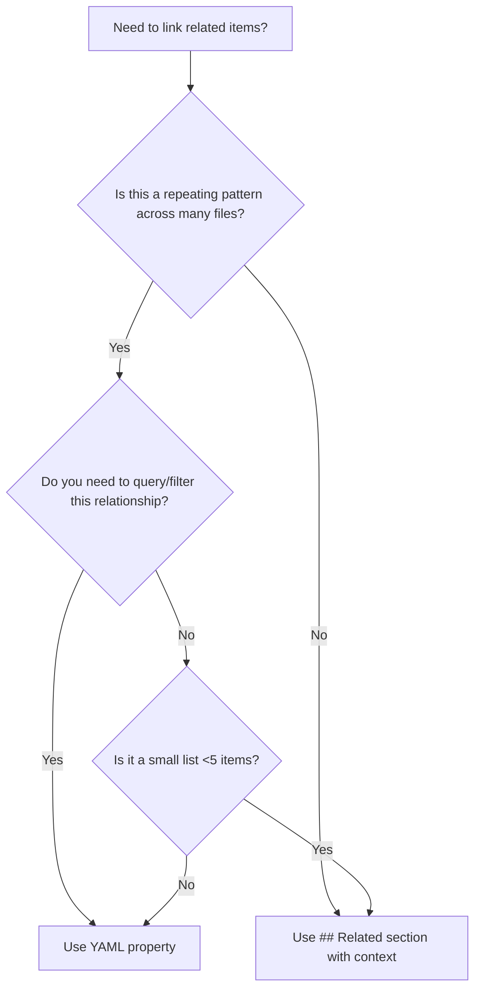
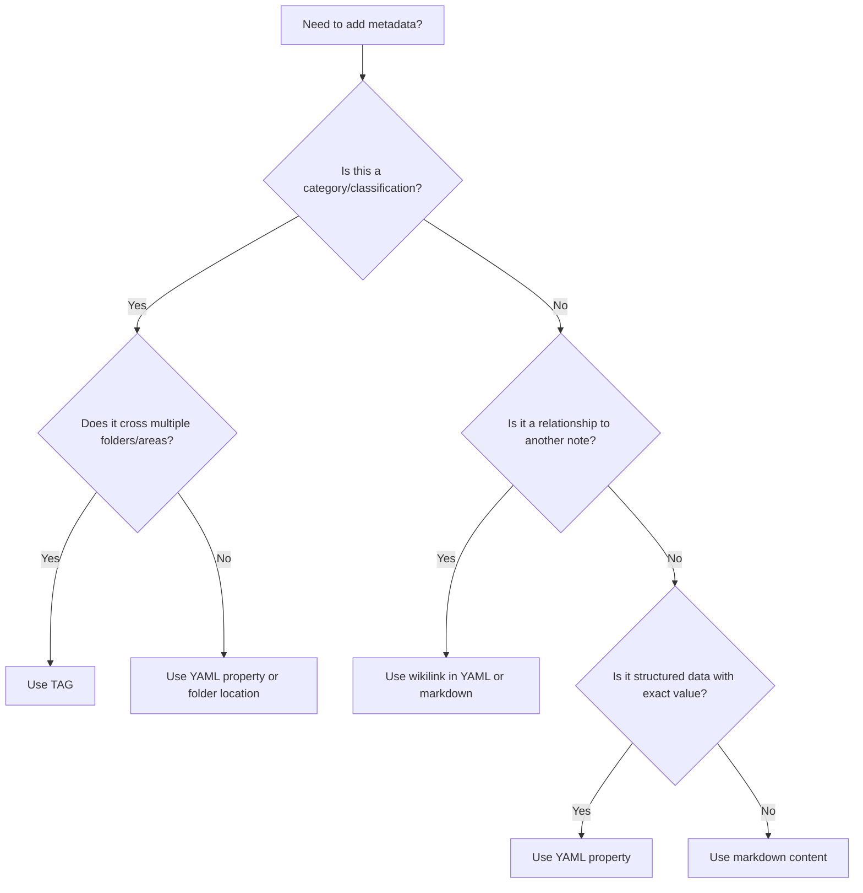

MOC -- human readable and LLM, small sets -- sections, sorting, nesting, descrips
YAML -- structured data, tagging, for later queries -- batch created notes
- can query and then add to MOC (if forgot)

| Use Case                         | Tags                                   | YAML Properties                    |
| -------------------------------- | -------------------------------------- | ---------------------------------- |
| **Multi-dimensional categories** | ✅ `tags: [sql, analytics, production]` | ❌ Would need 3 separate properties |
| **Cross-vault filtering**        | ✅ "Show all `#sql` notes"              | ⚠️ Requires DataView query         |
| **Exact value matching**         | ❌ Can't do `database: CentralC9`       | ✅ Precise metadata                 |
| **Hierarchical classification**  | ✅ `#domain/clinical/patients`          | ❌ Would need nested objects        |
| **Boolean flags**                | ❌ Awkward (`#has-examples`?)           | ✅ `has_examples: true`             |
| **Relationships**                | ❌ No linking capability                | ✅ `related_tables: [Table1]`       |


---
# MOC
- **Contextual narrative** ("this relates because...")
- **Mixed link types** (concepts, tools, scripts, external URLs)
- **Annotated relationships** (explaining WHY they're related)
- **One-off connections** (not queryable patterns)

### **Example (Concept File):**
```markdown
# Concepts MOC (Manual Curation)

## Core Methodology (What I use daily)
[Concepts - Solid + Dry]
[Concepts - Naming]

## Learning Queue (Stuff I'm digesting)
[Concepts - NoSQL] #status/active
[Concepts - Prompt Engineering (AI)] #status/todo

---

## All Concepts (Dynamic Backup)
```dataview
TABLE category, tags
FROM "08 - Concepts"
SORT file.name ASC
```
```
## Related
- [Patient Status History] — Tracks status changes over time
- [SQL - Get Patient Dupes] — Troubleshooting script for composite key issues
- [HIPAA Guidelines](https://example.com) — Privacy considerations
```

---
# YAML


### METADATA
```yaml
---
# YAML Properties = Structured data
object_type: table # {column, proc}
database: CentralC9
schema: dbo
dependencies: # list objects no order
impacts: [Measure1, Measure2]
row_count: 2500000
last_refreshed: 2026-01-05
owner_technical: 
owner_semantic: 

# Tags = Cross-cutting categories
tags:
  - database/table
  - domain/clinical
  - size/large
  - frequency/daily
related_concepts
---
```

**Why this split:**
- `database: CentralC9` → Exact value for queries like "WHERE database = 'CentralC9'"
- `tags: [database/table]` → Grouping for "show me all tables" (vs views, procedures)
- `tags: [domain/clinical]` → Cross-cutting filter (clinical tables exist in multiple databases)
- `tags: [size/large]` → Classification that doesn't fit neatly in a single property

---
# Hybrid
**For Patients domain file:**

```yaml
---
aliases: [Patient, Pat]
object_type: concept
database_tables: [dbo.Patients, dbo.PatientStatusHistory]  # Queryable pattern
troubleshooting_scripts: [SQL - Get Patient Dupes]        # Queryable pattern
---

# Patients

**PatId** is **non-unique**.  
**Composite Key:** `SourceSystemId + PatGUID`

## Patient Status Taxonomy
[...enumerations...]

## Related Concepts
- [Appointments] — Patient scheduling dependency
- [Contracts] — Eligibility determination (see Contract Start logic)
- [Financials - Production] — Patient visits drive production metrics

## Scripts
- [SQL - Get Patient Dupes] — Troubleshoot composite key violations
```

**Why this split:**
- `database_tables:` in YAML → you'll query "find all concepts touching PatientStatusHistory"
- `troubleshooting_scripts:` in YAML → you'll query "find all debugging tools for this domain"
- `## Related Concepts` in markdown → narrative explanation of conceptual dependencies (not queryable, contextual)

---

If you can't decide, ask: **"Will I DataView query this?"** 
- If yes → YAML
- If no → markdown

| Feature         | MOCs (Manual/Curated)                  | DataView Queries (Dynamic)         |
| --------------- | -------------------------------------- | ---------------------------------- |
| **Purpose**     | Narrative, contextualized grouping     | Exhaustive, rule-based filtering   |
| **Curation**    | You choose what matters NOW            | Shows everything matching criteria |
| **Context**     | Adds commentary, sections, ordering    | No context—just raw matches        |
| **Maintenance** | Manual updates when you learn/refactor | Auto-updates when files change     |
| **Discovery**   | Helps YOU see connections              | Helps FIND things you forgot       |
## Decision Tree



---

# Tags: The Multi-Dimensional Filter System

## What Tags Are (vs What They're NOT)

Tags are **cross-cutting labels** that ignore your file structure. They answer: "Show me all notes with THIS characteristic, regardless of where they live."

| Organizational Method | What It Does | What It Can't Do |
|----------------------|--------------|------------------|
| **Folders** | Physical location grouping | Can't be in 2 places at once |
| **Links** | Explicit relationships | Doesn't aggregate/filter |
| **YAML properties** | Structured metadata | Requires exact property match |
| **Tags** | Multi-dimensional filtering | No hierarchy enforcement |

**Key insight:** A note can have ONE folder, but MANY tags. Tags let you slice your vault different ways without reorganizing files.

---

## Tags vs YAML Properties: When to Use Each

This is where people get confused. Both are metadata, but serve different purposes:

**Rule:** Use **tags for categories/classification**. Use **YAML properties for structured data**.

---

## Tag Taxonomy: Flat vs Hierarchical

You're already using hierarchical tags: `#status/active`, `#status/todo`. Should you keep this pattern?

### Flat Tags
```yaml
tags: [sql, concept, patient, clinical]
```
**Pros:** Simple, fast to type  
**Cons:** No grouping, scales poorly (50+ tags get messy)

### Hierarchical Tags (Recommended)
```yaml
tags:
  - tool/sql
  - content-type/concept
  - domain/clinical/patients
  - status/active
```
**Pros:** Auto-groups in tag pane, filterable by level (`#domain` shows ALL domains)  
**Cons:** Longer to type, requires planning

**Your current workflow already uses this!** (`#status/active`, `#status/todo`)

---

## Real Examples from Your Vault

### Current State: `SQL - Get Patient Dupes.md`
```markdown
# SQL - Get Patient Dupes

[...SQL query code...]
```

### Refactored with Tags:
```yaml
---
tags:
  - tool/sql
  - content-type/script
  - domain/clinical/patients
  - use-case/troubleshooting
---

# SQL - Get Patient Dupes

[...SQL query code...]
```

**Now you can query:**
- "All SQL scripts" → `WHERE contains(tags, "tool/sql")`
- "All patient-related notes" → `WHERE contains(tags, "domain/clinical/patients")`
- "All troubleshooting tools" → `WHERE contains(tags, "use-case/troubleshooting")`

---

## Decision Tree: Tags vs YAML Properties vs Links



---

## Practical Migration Plan

**Phase 1:** Add tags to 5 pilot files (1 per category)
```yaml
# SQL - Get Patient Dupes.md
tags: [tool/sql, content-type/script, domain/clinical]

# Concepts - NoSQL.md
tags: [content-type/concept, domain/technical, tool/nosql]

# Types - Patient Status.md
tags: [content-type/reference, domain/clinical]

# Tools - 💠 Obsidian.md
tags: [content-type/guide, tool/obsidian, domain/methodology]

# 03 - Dictionary/Directory.md
tags: [content-type/definition, domain/technical]
```

**Phase 2:** Create tag query dashboard
```markdown
# Tag Dashboard

## Active Learning
```dataview
TABLE file.name, domain
FROM "08 - Concepts"
WHERE contains(tags, "learning-stage/active")
```

## SQL Tools by Domain
```dataview
TABLE domain, use-case
WHERE contains(tags, "tool/sql")
GROUP BY domain
```
```

**Phase 3:** Apply tags to new files via templates (update `00 - Templates/`)

**Phase 4:** Retrofit old files in batches (10-20 at a time when editing them)

---

## Summary: The 4 Organizational Layers

| Layer | Purpose | Example | When to Use |
|-------|---------|---------|-------------|
| **Folders** | Physical grouping | `08 - Concepts/` | Major categories (5-10 folders max) |
| **YAML Properties** | Structured data | `database: CentralC9` | Exact values, relationships |
| **Tags** | Cross-cutting filters | `#domain/clinical` | Multi-dimensional categories |
| **Links** | Explicit relationships | `[Appointments]` | Note-to-note connections |

**Use ALL FOUR.** They're complementary, not competing.

**Rule of Thumb:**
- **Folders** = Where it lives (physical)
- **Tags** = What it is (categorical)
- **YAML properties** = What it contains (data)
- **Links** = What it connects to (relationships)
```
```
