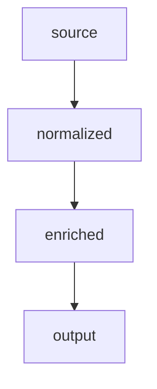

````text
Transform the input below into a concise implementation-ready Markdown workbook.

INPUT
[paste any request, source schema, column list, SQL, sample data, or notes]

RETURN ONLY THESE SECTIONS

## Do This
| Check | Action | Input -> Output / Decision |
|---|---|---|
| ... | ... | ... |

## Transformations
```text
source_name -> target_name
source_type -> target_type
...
```

## Object Map


```text
SOURCE
├── object
│   ├── column -> normalized_column
│   └── column -> normalized_column
└── output
```

## Warnings
- only ambiguity, collision, missing input, unknown abbreviation, timezone issue,
  key failure, datatype exception, or >5-7 column review

## Open Decisions
- only decisions that require a human or a missing test

FORMAT RULES
- No introduction, summary, duplicated standard, or explanatory essay.
- Prefer tables, arrows, code blocks, checkboxes, and one-line warnings.
- Keep accepted mappings stable on reruns; show only changed mappings when a prior result is supplied.
- Use `source -> target`; use `[flag: reason]` for uncertainty.
- Use Mermaid for relationships or decisions and ASCII trees for hierarchy or object structure.
- Do not invent keys, abbreviations, timezones, datatypes, or resolved decisions.
- If evidence is missing, write `?` or `[manual]` and place it in Warnings/Open Decisions.
````

## Compact Notation

```text
lower_snake_case | singular table | _ = word | __ = boundary
leading number -> trailing number | unknown abbreviation -> expand + flag
int key -> _id | business/padded key -> _code | GUID/UUID -> _guid
UTC -> _utc | known local + location key -> _local | unknown timezone -> warn
unique? yes -> suffix decision | no -> top 3 composite candidates
```
