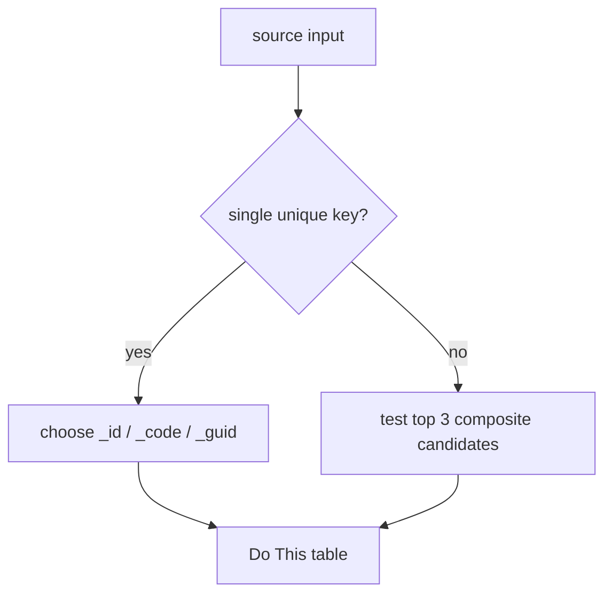

[[Standard - Naming - File or Folder]]

```text
Re-run the same compact workbook format against the prior result and this change:
[paste change]

Keep accepted names stable. Return only:
1. changed rows in Do This or Transformations
2. new Warnings
3. new Open Decisions
4. updated Mermaid or ASCII tree only if structure changed
```

## Output Examples

```text
SourceSystemId -> source_system_id
patGUID -> pat_guid
empGUIDTreatmentCoordinator -> emp_guid_treatment_coordinator
123MyColumn -> my_column_123
ProductionAmount -> production_amount [flag: confirm pdx abbreviation]
```

```text
PATIENT_STATUS_HISTORY
├── source_system_id
├── pat_guid
├── ptstat_guid
└── load_datetime_utc
```



## Living Document Rules

- Add a new compact notation only when it is reused.
- Add recurring ambiguity patterns to Warnings.
- Keep this prompt format-focused; put policy changes in [[Standard - Naming - Artifacts]].

