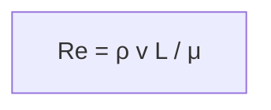
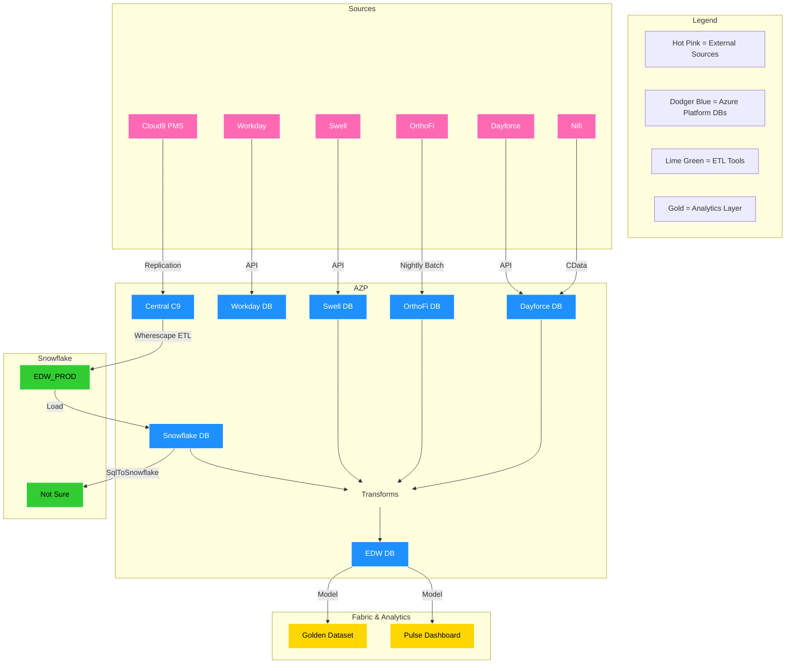
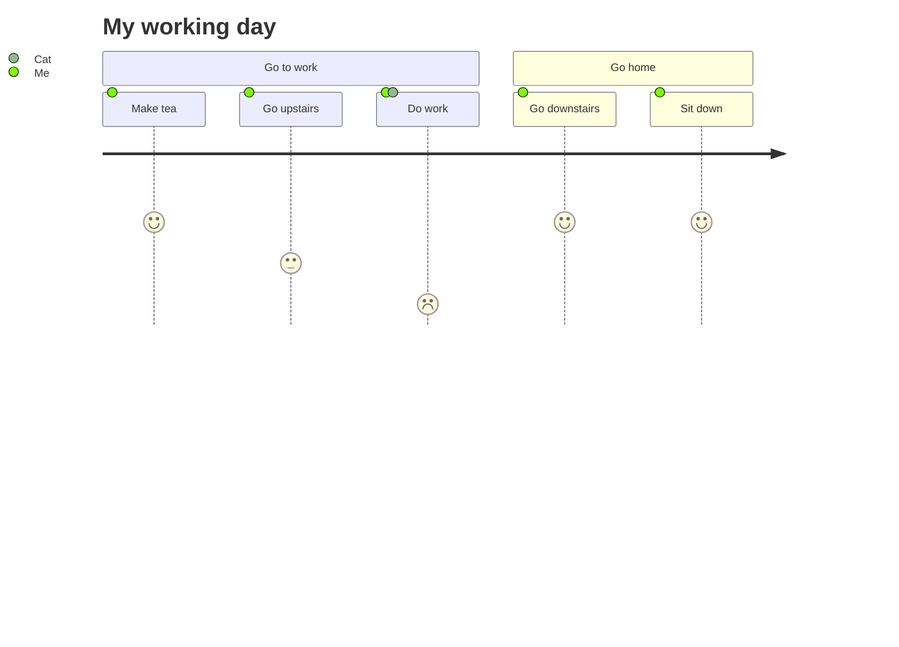
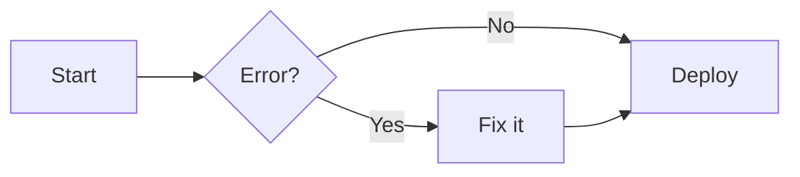
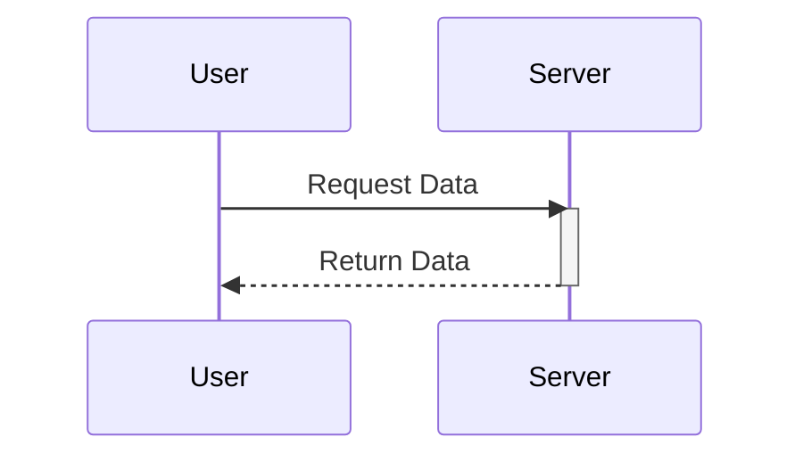
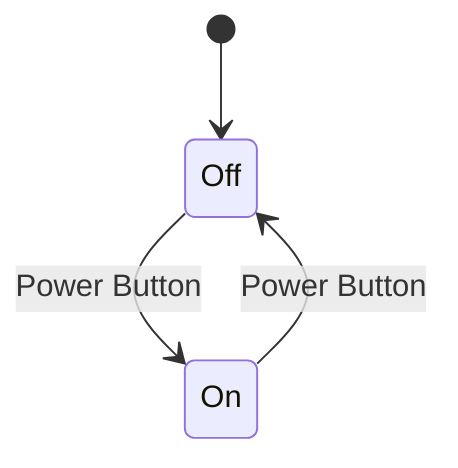
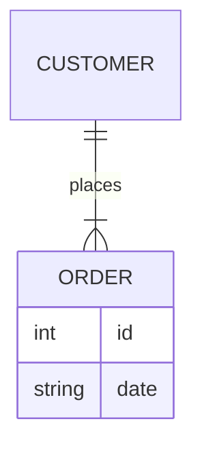
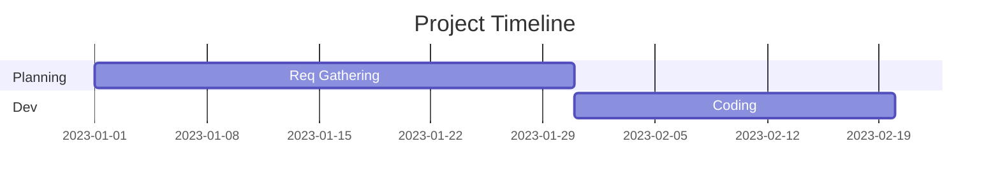
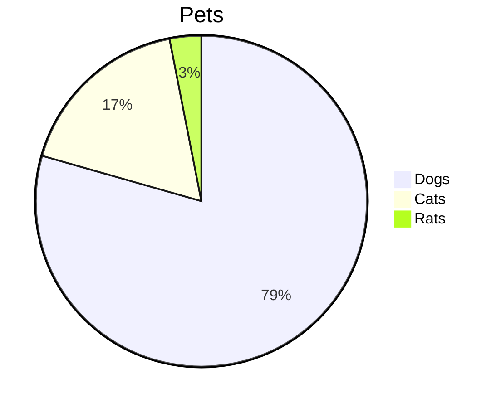
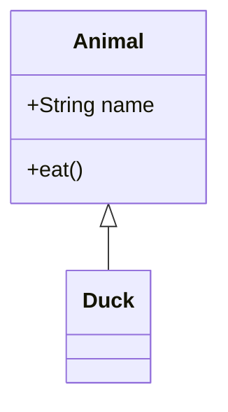

- flowchart TB | flowchart LR
- alias`["Display Name"]
- `%%` for comment lines
- subgraph | end | tab center block

```
flowchart TB

%% === 
%% Commment Header
%% ===

%% recommended: list all objects first (see orphans clearly)
B(["B"]) 
  %% syntax label[visual label] 
  %% paren --> circle icon
  %% "" is if have spaces, best to use though by default
  %% use <br> to elongate the box (tall vs wide)

subgraph ext["External Data Sources"]
	cl9["Cloud9"]
	ofi["OrthoFi"]
	dyf["Dayforce"]
	exp["Expensya"]
	SSIDS["128<br>129<br>130<br>131<br>132<br>133<br>134<br>135<br>136"]
end

subgraph ap_ar_pay["AR AP Payment"]
	sup["Suppliers - Invoice, Accrual, Payment"]
	csh["Cash Receipts Journal"]
end

%% general flows
ofi --> Workday
exp --> Workday
sup --> Workday
csh --> Workday

%% flows w bridge
cl9 --> |CollectionsByPatient| Workday
dyf -- " Labor_Hours " --> Workday

%% icon modification
A --> B 


```


```table-of-contents
```



```text
flowchart TD
    A["Re = ρ v L / μ"]
```





```shell

graph TB
    %% Legend
    subgraph Legend    
    %%direction TB

        L1[Hot Pink = External Sources]
        L2[Dodger Blue = Azure Platform DBs]
        L3[Lime Green = ETL Tools]
        L4[Gold = Analytics Layer]

    end

    %% External Sources

    subgraph Sources    

        Cloud9_SRC[Cloud9 PMS]
        Workday_SRC[Workday]
        Dayforce_SRC[Dayforce]
        OrthoFi_SRC[OrthoFi]
        Swell_SRC[Swell]
        Nifi_SRC[Nifi]        

    end

    %% Azure Platform (Internal DB Layer)

    subgraph AZP

        CentralC9[Central C9]
        Workday_DB[Workday DB]
        Dayforce_DB[Dayforce DB]
        OrthoFi_DB[OrthoFi DB]
        Snowflake_DB[Snowflake DB]
        EDW_DB[EDW DB]
        Swell_DB[Swell DB]
        EDW_Transforms[Transforms]

    end

    %% ETL Tools

    subgraph Snowflake

        %%Wherescape[Wherescape ETL]        

        EDW_PROD[EDW_PROD]

        OTHER_DB[Not Sure]

    end

    %% Analytics

    subgraph Fabric & Analytics

        GLD[Golden Dataset]

        Pulse[Pulse Dashboard]

    end

    %% Flows
    Cloud9_SRC --> |Replication| CentralC9
    CentralC9 --> |Wherescape ETL| EDW_PROD
    EDW_PROD --> |Load| Snowflake_DB    
    EDW_DB --> |Model| Pulse
    EDW_DB --> |Model| GLD
    Workday_SRC --> |API| Workday_DB
    Dayforce_SRC --> |API| Dayforce_DB
    OrthoFi_SRC --> |Nightly Batch| OrthoFi_DB
    Swell_SRC --> |API| Swell_DB
    Nifi_SRC --> |CData| Dayforce_DB
    Snowflake_DB -->  EDW_Transforms
    Swell_DB -->  EDW_Transforms
    OrthoFi_DB -->  EDW_Transforms
    Dayforce_DB -->  EDW_Transforms
    EDW_Transforms --> EDW_DB    
    Snowflake_DB --> |SqlToSnowflake| OTHER_DB

    %% Styling for Dark Mode

    classDef source fill:#ff69b4,stroke:#fff,stroke-width:1px,color:#fff;
    classDef azp fill:#1e90ff,stroke:#fff,stroke-width:1px,color:#fff;
    classDef etl fill:#32cd32,stroke:#fff,stroke-width:1px,color:#000;
    classDef analytics fill:#ffd700,stroke:#fff,stroke-width:1px,color:#000;
    class Cloud9_SRC,Workday_SRC,Dayforce_SRC,OrthoFi_SRC,Swell_SRC,Nifi_SRC source;
    class CentralC9,Workday_DB,Dayforce_DB,OrthoFi_EDW,Snowflake_DB,EDW_DB,Swell_DB,OrthoFi_DB azp;

    class Wherescape,EDW_PROD,OTHER_DB etl;
    class GLD,Pulse analytics;

    %% Make merge node invisible
    classDef transparent fill:none,stroke:none;
    class EDW_Transforms transparent;

```

| Server | Description |
| ------ | ------- |
|C9P | PMS Production Servers|
| AZD | DEV |
| AZT | UAT |
| AZP | Centralized from Production -- CentralC9, Lake |

**Pipeline Schedule Location:** AZP -- EDW.bi.PipelineConfig
**Integration modes:** API, file, manual.

1. **`classDef` vs `style`:**
    
    - **`style ID ...`**: Applies styles directly to one node (e.g., `style HTTP`). This is what you want here.
    - **`classDef Name ...`**: Creates a reusable class. You would then have to add a second line `class HTTP Name` to apply it. The error implies the parser got confused by the definition syntax.
        
### 1. Flowcharts (Graph)

**Definition:** `graph` or `flowchart` followed by direction (`TD` = Top-Down, `LR` = Left-Right).

| **Feature**         | **Syntax**   | **Example**                                              |
| ------------------- | ------------ | -------------------------------------------------------- |
| **Nodes (Shapes)**  | `id[Text]`   | `A[Square]`, `B(Round)`, `C([Stadium])`, `D{Decision}`   |
| **Links (Arrows)**  | `-->`, `---` | `A --> B` (Arrow), `A --- B` (Line), `A -.-> B` (Dotted) |
| **Labels on Links** | `            | Text                                                     |
| **Chaining**        | `&`          | `A --> B & C`                                            |
| **Subgraphs**       | `subgraph`   | `subgraph One [Title] ... end`                           |


```
	journey
    title My working day
    section Go to work
      Make tea: 5: Me
      Go upstairs: 3: Me
      Do work: 1: Me, Cat
    section Go home
      Go downstairs: 5: Me
      Sit down: 5: Me
```

---



```
graph LR
    A[Start] --> B{Error?}
    B -->|Yes| C[Fix it]
    B -->|No| D[Deploy]
    C --> D
```

---

### 2. Sequence Diagrams

**Definition:** `sequenceDiagram`

|**Feature**|**Syntax**|**Example**|
|---|---|---|
|**Participants**|`participant` or `actor`|`actor User`, `participant DB`|
|**Messages**|`->`, `-->`|`A->B: Request`, `B-->A: Response` (Dotted)|
|**Activations**|`activate`, `deactivate`|`activate B`, `deactivate B` (or use `+`/`-` suffix)|
|**Notes**|`Note right of`|`Note right of A: Thinking...`|
|**Loops/Alt**|`loop`, `alt`|`loop Check... end`, `alt Success... else Fail... end`|

**Example:**



```
sequenceDiagram
    participant U as User
    participant S as Server
    U->>S: Request Data
    activate S
    S-->>U: Return Data
    deactivate S
```

---

### State Diagrams

**Definition:** `stateDiagram-v2`

|**Feature**|**Syntax**|**Example**|
|---|---|---|
|**Start/End**|`[*]`|`[*] --> Still`|
|**Transitions**|`-->`|`Still --> Moving`|
|**Composite**|`state Name { ... }`|`state Working { ... }`|
|**Notes**|`note right of`|`note right of Still: Waiting`|

**Example:**

Code snippet


```
stateDiagram-v2
    [*] --> Off
    Off --> On : Power Button
    On --> Off : Power Button
```

---

### Entity Relationship (ER) Diagrams

**Definition:** `erDiagram`

|**Feature**|**Syntax**|**Example**|
|---|---|---|
|**One to One**|`||
|**One to Many**|`||
|**Many to Many**|`}|--|
|**Attributes**|`{ type name }`|`User { string name int age }`|

**Example:**



```
erDiagram
    CUSTOMER ||--|{ ORDER : places
    ORDER {
        int id
        string date
    }
```


### Gantt Chart



```
gantt
    title Project Timeline
    section Planning
    Req Gathering :a1, 2023-01-01, 30d
    section Dev
    Coding :after a1, 20d
```

### 6. Pie Charts & Gantt

**Pie Chart:**




```
pie title Pets
    "Dogs" : 386
    "Cats" : 85
    "Rats" : 15
```


---

### 3. Class Diagrams

**Definition:** `classDiagram`

|**Feature**|**Syntax**|**Example**|
|---|---|---|
|**Define Class**|`class Name`|`class Animal`|
|**Members**|`Type name`|`+String name`, `+bark()`|
|**Visibility**|`+`, `-`, `#`|`+Public`, `-Private`, `#Protected`|
|**Inheritance**|`<|--`|
|**Composition**|`*--`|`Car *-- Engine`|
|**Aggregation**|`o--`|`Library o-- Book`|



```
classDiagram
    class Animal {
        +String name
        +eat()
    }
    Animal <|-- Duck
```

