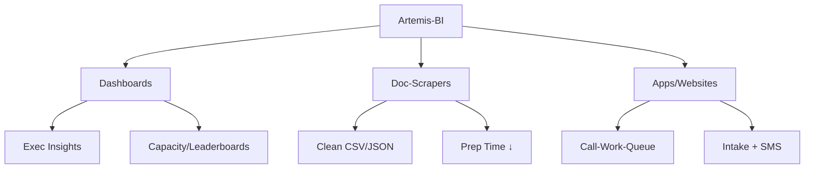

Breakdown of services





# Most Common Pain Points
Sales, AR Collection, AP Negotiation


# Storefront
Website: Website (Static)
WebApp: Website (Dynamic)
- Checkout: Stripe
- Ecommerce: Gallery + Checkout

# Orchestrators
## CRM
[[Call-Work-Queue]] - CRM Logger

## Forms 
[[Form-builder]]
- [[Intake-Form]]

# Accelerators
RPA: Robotic Process Automation
## Doc-Scraper
take digital asset (xls, pdf, doc), scrape key elements, output as csv or xlsx, process in batches
- [[PRJ - Tax Doc-Scraper]]

## Web-Scraper
take a website, `process-automate` repetitive tasks

## Sql-Scraper
```
normalize objects and aliases. 
  remove comment lines and blocks
  ALL CAPS
  map, remove aliases

identify objects and aliases
  identify objects from and joins 
  identify and remove junk (not used)
  identify functions 
  from objects --> aliases, "as" separator
  add spaces around "()" -- consistent for REGEX
identify stages in sequence: repeat above
  ignore `#tmp` inserts

validation
normalize queries for nulls. {0, unknown}
persist RowId
identify keys
identify samples per stage; tmp-tables
  row count 
  sum of certain columns
  thresholds
```


# Analytical 
KPI & Data Visualization: [[Types - Dashboards]]

