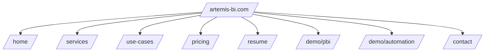

> [!abstract] TLDR
Ready-to-paste site copy blocks: refined “What is a Data Engineer?”, Artemis versions of HiHello sections, service tiles, and use-case cards.

# Artemis‑BI Content Blocks

## "What is a Data Engineer?" (Refined Site Copy)
Data should circulate through your business like clean water—source → pipelines → models → surfaces (dashboards/apps) → decisions. When it stagnates in spreadsheets and ad‑hoc exports, it becomes noisy, unreliable, and expensive. A data engineer designs the flow and reliability.

- Capture → connect systems and APIs safely.
- Normalize → enforce consistent shapes and definitions.
- Orchestrate → keep data fresh with built‑in error handling.
- Secure → row‑level security (RLS), audit trails, retention.
- Observe → latency, errors, usage → continuous improvement.

I partner with you to build the infrastructure that keeps decisions nimble as you grow—so you steer the business, not wrangle files.

## Home Page — Headline & Taglines
- Headline → "BI, Automations, and Analytics—Built for Mid‑Market Momentum."
- Tagline → "From raw data to boardroom clarity—fast."
- Sub‑taglines
  - "Dashboards that explain ‘why’, not just ‘what’."
  - "Automate the boring; elevate advisory."
  - "Orthodontics, Manufacturing, and Tax workflows—ready‑to‑run."

## Service Tiles (Lead 3)
- Dashboards → Executive insights; capacity; leaderboards; exception alerts → faster decisions.
- Doc‑Scrapers → PDFs/XLS → clean CSV/JSON; compliance‑aware intake → prep time ↓.
- App Builds / Websites → Call‑Work‑Queue; intake forms; SMS; static sites → quick wins.

## Engagement Models (Copy)
- Embedded → employee‑style; deep custom; full access.
- Injected → low‑footprint local app; scheduled loads.
- Hosted → flat‑fee templates; on‑demand; lowest cost; upsell for custom.
- Bridged → manual drag‑and‑drop workflows + notifications.

## Pricing Summaries (Cards)
- Professional → $299–$699; $49–$149/mo; $99 setup + $19–$39/mo; upsell mini dashboard.
- Business → $2.5K–$4K; $2K–$3K; $3K–$6K; ~$2K app; $750–$1,500/mo retainer.
- Enterprise → $25K–$75K projects; $15K–$40K dashboards; $8K–$14K/mo premium retainer.

## Use‑Case Card Templates
- Problem → succinct pain.
- Approach → solution components.
- Outcome → measurable changes.
- Metrics → % or counts.
- Next Step → CTA.

### Seeds (Copy you can paste)
- Orthodontics → High no‑shows → SlideSMS + capacity dashboard → no‑shows ↓ 25%, utilization ↑ 12% → "Book a demo".
- Tax → Shoebox PDFs → Doc‑Scraper → prep time ↓ ~50%, write‑offs ↓ 30% → "Pilot 10 clients".
- Manufacturing → Post‑ERP ops blind spots → ops signals dashboard → delays ↓ 22%, stockouts ↓ 15% → "30‑day POC".
- Sales Ops → Leads not converting → Call‑Work‑Queue + drip alarms → recovery ↑ → "Start starter app".
- FP&A → AP cash crunch → vendor term dispersion + alerts → late fees ↓ → "Advisory bundle".

## Artemis Versions of HiHello Sections
- Elevate Your Professional Presence → Elevate Your Data Presence → "Clarity at a glance; actions in one click."
- Digital Business Cards → Service Tiles (Dashboards, Doc‑Scraper, Apps) → clean summaries with consistent branding.
- Email Signature → Optional: professional email signature with branded link to dashboards/report.
- Email Signature Manager → Optional: automate signatures across small teams.
- Professional Virtual Backgrounds → Demo GIFs (Office Scripts/automations) to show action.
- Employee Directory → Optional: engagement roster and credentials for team rollouts.
- Custom Lead Capture → Pre‑intake forms + compliant flows.
- Card Scanning → Doc‑Scraper (scan/digitize W2/1099/K‑1; insurance cards).
- Event Lead Retrieval → Event lead capture → tracked short links + simple intake.
- Business Contact Manager → CRM sync (Salesforce/Dynamics/HubSpot) roadmap.
- Contact Enrichment → Optional contact enrichment return for captured leads.
- User Management → Provisioning for hosted/injected engagements.
- CRM & Marketing Automation → Send contacts/leads to CRM; email platforms (Mailchimp/Marketo) roadmap.
- Analytics & Insights → Track views/shares/engagement with GA4 + Cosmos events.

## Directory Tree — Site Structure (Text)
- /
  - /home → headline, icons, CTA
  - /services → dashboards, doc‑scrapers, apps; engagement models
  - /use‑cases → 6–8 cards
  - /pricing → tiers
  - /resume → highlights + full doc link
  - /demo/pbi → embedded report
  - /demo/automation → Office Script GIF
  - /contact → form + calendar

