> [!abstract] TLDR
Five text wireframes to visualize page layout and hierarchy before design.

# Artemis‑BI Wireframes (Text Mockups)

my-portfolio/
├── public/              # Raw static assets (favicon, robots.txt)
├── src/
│   ├── assets/          # Images and SVGs used in components
│   ├── components/      # REUSABLE UI units (The "LEGO" bricks)
│   │   ├── Button.tsx
│   │   ├── Card.tsx
│   │   └── Navbar.tsx
│   ├── content/         # YOUR TALKING POINTS (The "Copy" data)
│   │   ├── copy.ts      # The single source of truth for text
│   │   └── projects.ts  # Data for your UX case studies
│   ├── sections/        # PAGE-SPECIFIC LAYOUTS
│   │   ├── Hero.tsx     # Uses copy.ts to fill content
│   │   └── ProjectGrid.tsx
│   ├── styles/          # Global CSS & Tailwind config
│   │   └── index.css
│   ├── App.tsx          # The "Master Assembly" file
│   └── main.tsx         # The entry point for the browser
├── .gitignore           # Files to exclude from GitHub
├── tailwind.config.js   # Design tokens (Colors, Fonts)
├── tsconfig.json        # TypeScript rules
└── vite.config.ts       # Vite configuration

my-portfolio/
├── .devcontainer/      # (Optional) Config for the VS Code "Virtual Env"
├── .github/             # Automated deployment scripts (Actions)
├── src/                 # (As defined previously)
├── .node-version        # Forces the correct Node version
├── .env                 # Local variables (e.g., API_URL=localhost)
├── .env.production      # Production variables (e.g., API_URL=your-vm-ip)
├── docker-compose.yml   # (Optional) To mirror your Linux VM locally
└── package.json         # Your engine and dependency definitions

### Visualizing the Data Flow

1. **`src/content/copy.ts`** holds your text: `export const HERO_TITLE = "UX Researcher";`
2. **`src/sections/Hero.tsx`** imports that text: `<h1>{HERO_TITLE}</h1>`
3. **Tailwind** styles it: `<h1 className="text-6xl font-bold">{HERO_TITLE}</h1>`

## Wireframe 1 — Home
- Hero
  - Headline: BI, Automations, and Analytics—Built for Mid‑Market Momentum.
  - Subline: From raw data to boardroom clarity—fast.
  - CTA: Schedule a Call
- Three Icons
  - Dashboards that explain ‘why’
  - Automate the boring
  - Ready‑to‑run workflows
- Featured Services (tiles)
  - Dashboards → Learn more
  - Doc‑Scrapers → Learn more
  - App Builds/Websites → Learn more
- Proof
  - Embedded PBI (teaser)
  - Office Script GIF (teaser)
- Secondary CTA
  - View Pricing → Contact

## Wireframe 2 — Services
- Lead Paragraph
  - What you deliver; why mid‑market benefits.
- Tiles (Grid)
  - Dashboards → Exec insights, capacity, leaderboards, exceptions
  - Doc‑Scrapers → PDFs/XLS → clean CSV/JSON
  - App Builds/Websites → Call‑Work‑Queue, intake forms, SMS
- Engagement Models (4)
  - Embedded | Injected | Hosted | Bridged
- CTA
  - Book a 10‑minute demo

## Wireframe 3 — Use Cases
- Intro
  - How to read the cards; short stories.
- Cards (Repeating)
  - Title (e.g., Orthodontics No‑Show Reduction)
  - Problem → Approach → Outcome → Metrics → Next Step
- CTA
  - View Pricing → Schedule a Call

## Wireframe 4 — Pricing
- Tier Cards (3)
  - Professional → $299–$699; $49–$149/mo; $99 setup + $19–$39/mo
  - Business → $2.5K–$4K; $2K–$3K; $3K–$6K; ~$2K app; $750–$1,500/mo
  - Enterprise → $25K–$75K; $15K–$40K; $8K–$14K/mo
- Compare Grid (key inclusions)
  - Data sources, enhancement hours, SLA
- CTA
  - Schedule a Call

## Wireframe 5 — Contact
- Contact Form (name, email, company, notes)
- Calendar Embed (Google Business)
- Short Links (tracked)
- Optional Pre‑Intake upload

```mermaid
graph TD
  Home[Home Layout] --> Hero[Hero]
  Home --> Icons[3 Icons]
  Home --> ServicesTiles[Featured Services]
  Home --> Proof[Demo Teasers]
  Home --> CTA1[Schedule a Call]

  Services[Services Page] --> Tiles[Service Tiles]
  Services --> Models[Engagement Models]
  Services --> CTA2[10‑min Demo]

  UseCases[Use Cases Page] --> Cards[Cards]
  UseCases --> CTA3[Pricing → Call]

  Pricing[Pricing Page] --> Tiers[Tier Cards]
  Pricing --> Compare[Compare Grid]
  Pricing --> CTA4[Schedule a Call]

  Contact[Contact Page] --> Form[Form]
  Contact --> Calendar[Calendar]
  Contact --> Intake[Pre‑Intake]
```

