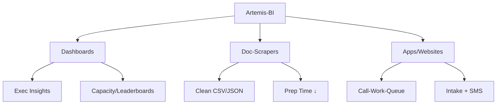

> [!abstract] TLDR
Mid‑market data engineering + FP&A services: Dashboards, Doc‑Scrapers, and App/Web builds; Azure OpenAI + Cosmos DB for AI/RAG; tiered packages priced ~−20% vs boutique competitors.

# Artemis‑BI Business Plan (Template)

## Vision → Positioning
- Data should uplift, not stress → pipelines that keep data fresh → dashboards that explain why → automations that remove drudgery → advisory insights that drive outcomes.
- Tagline → "From raw data to boardroom clarity—fast."
- Verticals → Orthodontics, Manufacturing, Tax/Accounting (expandable).

## Service Pillars → Outcomes
- Dashboards → Executive insights, capacity tracking, leaderboards → faster decisions.
- Doc‑Scrapers → Convert messy PDFs/XLS (W2/1099/K‑1, insurance cards) → clean CSV/JSON → cut prep time.
- App Builds / Websites → Lightweight apps (Call‑Work‑Queue), static sites, intake forms, SMS workflows.
- Engagement models → Embedded (employee‑style), Injected (low‑footprint app + scheduled loads), Hosted (flat‑fee templates), Bridged (manual plus notifications).

## Packages & Pricing (−20% Competitive)
- Professional (Solo/Small)
  - Starter Site + Contact Capture → $299–$699 one‑time → fast setup.
  - Office Script Automators → $49–$149/mo → monthly cleanup/report generation.
  - SlideSMS Basic → $99 setup + $19–$39/mo → 24h/2h appointment reminders.
  - Upsell → Mini Call‑Work‑Queue dashboard → $599–$999.
- Business (Team 3–20)
  - Ops Pulse Dashboards (Exec Insights, EOM tracker, Performance tracker) → $2.5K–$4K.
  - Capacity + SMS (SlideSMS + calendar capacity) → $2K–$3K.
  - Data Ingestion (1–2 sources via ADF/Fabric, normalized views, RLS) → $3K–$6K.
  - Call‑Work‑Queue web app + assignment/logging → ~$2K baseline.
  - Retainers → $750–$1,500/mo → maintenance, enhancements, FP&A monthly brief.
  - Defaults (chosen optimally): includes 2 data sources; 8 monthly enhancement hours; PBI sharing via Pro for MVP, upgrade to Embedded/Fabric for scaling.
- Enterprise (Multi‑location)
  - Data Lake + Pipelines (multi‑source, dev/test/prod, RLS) → $25K–$75K per project.
  - ERP Migration Dashboards (IBM DB2 → Infor CSI) → $15K–$40K.
  - Engagements → Embedded FTE‑equivalent or premium retainer $8K–$14K/mo with SLAs.

## Taglines → Talking Points → Objection Handling
- Taglines
  - "Automate the boring; elevate advisory."
  - "Dashboards that explain ‘why’, not just ‘what’."
  - "Orthodontics, Manufacturing, Tax workflows—ready‑to‑run."
- Talking Points
  - Reduce manual data entry with Doc‑Scraper (40–80% time savings on messy files).
  - Capacity visibility to lower no‑shows; SMS reminders and calendar ops.
  - FP&A alignment → budget vs actual, AP dispersion, vendor terms; exception alerts.
- Objections → Responses
  - Cost → Tiered entry + −20% pricing; deliver quick wins first.
  - Security → RLS, audit trail, HIPAA‑aware patterns; secure intake.
  - Change management → Templates + training; staged rollouts.

## Use Case Cards (Template)
- Card Structure → Problem → Approach → Outcome → Metrics → Next Step.
- Seeds
  - Orthodontics → High no‑show → SlideSMS + capacity dashboard → no‑shows ↓ 20–35% → Book a demo.
  - Tax Firm → Shoebox PDFs → Doc‑Scraper → prep time ↓ ~50% → Pilot with 10 clients.
  - Manufacturing → Post‑ERP ops blind spots → ops signals dashboard → production delays ↓ → 30‑day POC.
  - Sales Ops → Leads not converting → Call‑Work‑Queue + drip alarms → recovery ↑ → Starter app.
  - FP&A → AP cash crunch → vendor terms dispersion + alerts → late fees ↓ → Advisory bundle.

## AI Engine & Data Architecture (Azure‑First)
- Authoring & Assistant → Azure OpenAI GPT‑4.1 (quality), GPT‑4o (latency), GPT‑4o‑mini (cost‑efficient drafts).
- RAG → Embeddings (`text‑embedding‑3‑large` Azure equivalent) + Azure Cosmos DB vector search.
- Partitioning → Hierarchical Partition Keys (e.g., `tenantId:userId`) → avoid hotspots; targeted multi‑partition queries.
- SDK Practices → Singleton `CosmosClient`, retry‑after on 429, preferred regions; capture diagnostics.
- Observability → Azure Monitor + App Insights; event logging for CTA funnel.

## Terms (Template)
- Scope → deliverables, inclusions/exclusions; data sources count; enhancement hours.
- Security → RLS, PHI handling (HIPAA‑aware), audit trail, retention policy.
- Change Requests → written acceptance, impact analysis, pricing adjustments.
- Payment → milestones or monthly; net terms; late fees.

## Roadmap → Upsells
- Advisory shift → forecasting, scenario planning.
- CRM integrations → Salesforce/Dynamics/HubSpot.
- Training & enablement → self‑service guided dashboards.

## Regional & Channel Strategy
- Asheville‑first networking (events, referrals) → local credibility.
- Online outreach via LinkedIn → short link tracking → book calls.
