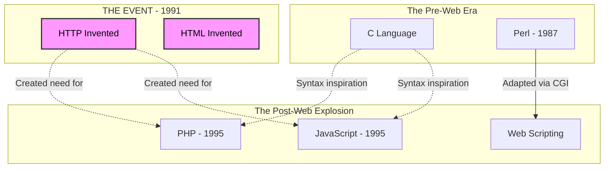

## Copy and Paste Feature (HTTP vs HTTPS)
- clipboard API requires secure connection (HTTPS)
- so need to point domain to VM IP, {Let's Encrypt + NGinx} as reverse proxy and enable https
- 

This is a crucial distinction! If we are looking at the family tree of **Languages** (the speakers), **HTTP/HTTPS** are not family members.

They are the **conversation**.

### The Conceptual Difference

- **The Languages (Perl, Python, PHP):** These are the tools used to construct the "Car."
    
- **HTTP (Hypertext Transfer Protocol):** This is the "Road" the car drives on.
    

However, in the context of history, **HTTP is the meteorite that hit the family tree.** Its invention in 1989/1991 forced the "Scripting" branch (Perl, Python, Ruby) to evolve rapidly to handle this new way of communicating.

### Where it fits on the Timeline

Chronologically, HTTP appears right in the middle of that "Scripting Lineage" I drew for you, right between **Perl** and **PHP**.

Here is how it fits into the diagram visually. I have updated the "Web Lineage" to show how HTTP acted as the **Catalyst**.

Code snippet

### The Narrative of the Diagram

1. **Before HTTP (1987):** **Perl** existed.1 It was used by system administrators to manage text files on servers. It didn't know what a "web page" was.
    
2. **The Event (1991):** Tim Berners-Lee invents **HTTP** (the rule that says "GET me this page") and **HTML** (the page itself).
    
3. **The "Glue" Phase:** People realized, "Hey, Perl is good at text. HTML is text. Let's force Perl to spit out HTML." This was called **CGI (Common Gateway Interface)**.
    
4. **The Evolution (1995):**
    
    - **PHP** was born _specifically_ because Rasmus Lerdorf wanted an easier way to wrap **C** code around **HTTP** requests.
        
    - **JavaScript** was born because Netscape needed a language to manipulate **HTML** inside the browser.2
        
    - **HTTPS** (1994) was added by Netscape shortly after to wrap that HTTP traffic in encryption (SSL).3
        

### Summary for your Mental Model

If you are visualizing the "Language Tree":

- **HTTP/HTTPS** is the **environment** that the languages live in.
    
- Just like animals evolved to live in water or on land, **PHP, JavaScript, and Ruby on Rails** evolved specifically to live in the **HTTP environment**.