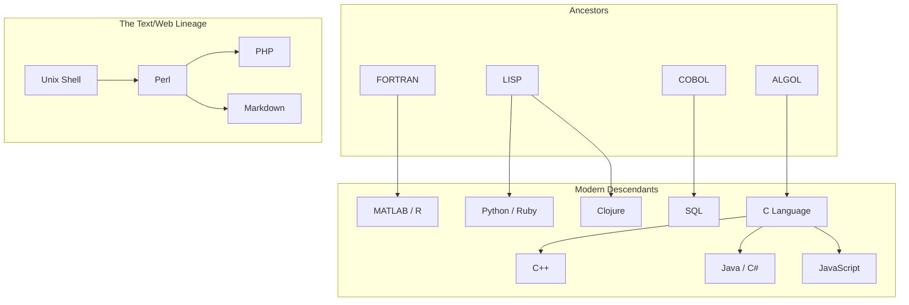

1. Original Markdown (2004 - John Gruber)
   │  "The Ur-Text." created for simple web-writing.
   │
   ├──> 2. MultiMarkdown (2005 - Fletcher Penney)
   │      ↳ WHY: Writers needed more features (Tables, Footnotes, Metadata).
   │
   ├──> 3. PHP Markdown Extra (2000s - Michel Fortin)
   │      ↳ WHY: CMS platforms (WordPress/Drupal) needed definitions & classes.
   │
   ├──> 4. CommonMark (2014 - Jeff Atwood & team)
   │      │ WHY: The "Strict Standard." Created to fix ambiguity.
   │      │ If you type X, it must ALWAYS render as Y.
   │      │
   │      └──> 5. GitHub Flavored Markdown (GFM)
   │             ↳ WHY: Developers needed code-specific features.
   │             ↳ Adds: Task lists, Tables, Auto-linking, Strikethrough.
   │             │
   │             └──> 6. The "PKM" Era (Obsidian, Logseq, etc.)
   │                    ↳ WHY: Personal Knowledge Management.
   │                    ↳ Adds: [[WikiLinks]], block references, formatting highlights ().
   │
   └──> 7. Pandoc (2006 - John MacFarlane)
          ↳ WHY: Academic & Universal conversion.
          ↳ Adds: Citations, LaTeX math support, raw power.

----
markdown 
multi-markdown ++ tables, footnotes, metadata
php markdown ++ wordpress/drupal needed definitions & classes
commonMark --> github --> obsidian/logseq (pkm -- personal knowledge management) -- wikilinks, block references, highlights
pandox -- academic/universal conversion (citations, latex, raw power)

----

    
ROOT: THE ANCESTORS (1950s)
│
├── [FORTRAN] (1957) "The Calculator"
│   │   DNA: Arrays, numeric formulas, speed.
│   │
│   └──> MATLAB
│   └──> R
│   └──> Julia
│
├── [LISP] (1958) "The Academic"
│   │   DNA: Dynamic typing, garbage collection, recursion.
│   │
│   ├──> Scheme / Common Lisp
│   ├──> Clojure
│   │    (Spiritual Successors)
│   └──> Python (Borrowed dynamic philosophy)
│   └──> Ruby   (Borrowed flexibility)
│
├── [ALGOL] (1958) "The Architect"
│   │   DNA: Code blocks {}, nested functions, structured logic.
│   │
│   └──> C (1972)
│        │
│        ├──> C++
│        │    └──> Rust (Safety evolution)
│        │
│        ├──> Objective-C
│        │    └──> Swift
│        │
│        ├──> Java
│        │    └──> C#
│        │    └──> Kotlin
│        │
│        └──> JavaScript (The syntactic cousin)
│             └──> TypeScript
│
└── [COBOL] (1959) "The Accountant"
        DNA: English-like syntax, record structures.
    
        └──> SQL (Structured Query Language)
        └──> ABAP (SAP systems)

THE SCRIPTING LINEAGE
│
├── [Unix Shell (sh)] (1971)
│   "Glue" for the operating system.
│   │
│   └──> [Perl] (1987)
│        "The Swiss Army Chainsaw" - Text processing king.
│        │
│        ├──> [PHP] (1995)
│        │    (Originally a set of Perl scripts for the web)
│        │
│        └──> [MARKDOWN] (2004)
│             (Not a language, but a formatting tool written in Perl
│              to convert text -> HTML)
│
└──> [Python] (1991) & [Ruby] (1995)
     merged the utility of Perl with the readability of ABC/Lisp.

That is a fantastic analogy. If Markdown is a modern "dialect" of formatting, the ancient languages (COBOL, Fortran, LISP) are the Latin, Greek, and Sanskrit of the coding world.

Here is the "Family Tree" of programming languages, traced back to the **Three Ancient Ancestors** (and one rebellious cousin) that emerged in the 1950s.

### The Programming Language Evolutionary Tree

### 1. The Ancestor: ALGOL (1958)

**"The Mother of All Modern Syntax"**

- **The Vibe:** Strict, logical, organized.
    
- **The DNA it passed down:** Blocks of code (using `{}` or `begin/end`), nested functions, and lexical scope.
    
- **The Descendants:** Almost everything you use today.
    
    - **C (1972):** The most successful child. C took ALGOL’s logic but stripped it down to be fast and raw.
        
    - **C++, Java, C#, JavaScript:** These are the grandchildren of ALGOL. If a language uses `{ curly braces }`, it is an ALGOL descendant.
        

### 2. The Ancestor: LISP (1958)

**"The Mystic / The Academic"**

- **The Vibe:** Mathematical, strange, powerful. Everything is a list `(parentheses everywhere)`.
    
- **The DNA it passed down:**
    
    - **Garbage Collection:** LISP invented the idea that the computer should clean up its own memory. Java and Python owe their lives to this.
        
    - **Dynamic Typing:** You don't have to say "this is a number"; the computer figures it out.
        
- **The Descendants:**
    - **Python & Ruby:** While they don't look like LISP, they inherited its "dynamic" philosophy—writing code fast without worrying about memory or strict types.
    - **Clojure:** A direct modern descendant still used today.

### 3. The Ancestor: COBOL (1959)

**"The Accountant"**

- **The Vibe:** Verbose, English-like, extremely stable. It was built for business, not science.
- **The DNA it passed down:**
    - **English Syntax:** `ADD 1 TO x` instead of `x++`.
    - **Records:** The idea of grouping data (Name, Address, Phone) into a single "Record" (struct) was popularized here.
        
- **The Descendants:**
    - **SQL:** While not a direct child, SQL is COBOL’s spiritual successor. Notice how SQL reads like English? (`SELECT * FROM Users WHERE...`). That is pure COBOL influence.
    - **Excel Formulas:** The business-logic style of Excel can be traced back to this mindset.

### 4. The Ancestor: FORTRAN (1957)

**"The Engineer"**
- **The Vibe:** Number crunching. Ugly code, but incredibly fast at math.
- **The DNA it passed down:** Arrays and Loops.
- **The Descendants:**
    - **MATLAB / R:** The languages used for data science today are the direct spiritual children of Fortran.

---

### The "Scripting" Lineage (Your specific question)

This is a fascinating sub-branch that leads directly to the **Markdown** you asked about.

1. The Shell (Unix sh, 1971)

Programmers needed a way to glue programs together. They created "Shell scripts."

- _Trait:_ Quick and dirty, used for text processing.
2. Perl (1987)

Larry Wall wanted something better than Shell. He created Perl, the "Swiss Army Chainsaw" of text processing.

- _Trait:_ It used symbols extensively (`$var`, `@array`, `%hash`) to distinguish data types quickly.
3. PHP (1995)

Created essentially as a set of Perl scripts to manage a "Personal Home Page."

- _Trait:_ It took Perl's syntax (the `$` signs) and put it on the web.
4. Ruby & Python (1990s)

They looked at Perl and said, "This is too messy. Let's make it readable like English (COBOL/ALGOL influence) but keep the power of LISP."

5. Markdown (2004)

John Gruber (a Perl enthusiast) wanted a way to write HTML without writing tags. He wrote the original Markdown compiler in Perl.

- _The Link:_ Markdown isn't a programming language; it is a **text-processing convention**. But it was born out of that Perl/Unix hacker culture that valued plain text over complex binary formats (like Word documents).

### Summary "Genealogy"

|**Ancient Ancestor**|**The "DNA"**|**Modern Children**|
|---|---|---|
|**ALGOL**|Code Blocks `{}`|C, Java, JavaScript, C++|
|**LISP**|Memory Mgmt / Dynamic|Python, Ruby, Garbage Collection|
|**COBOL**|English Readability|SQL, PL/SQL|
|**FORTRAN**|Math Arrays|MATLAB, R, NumPy|
