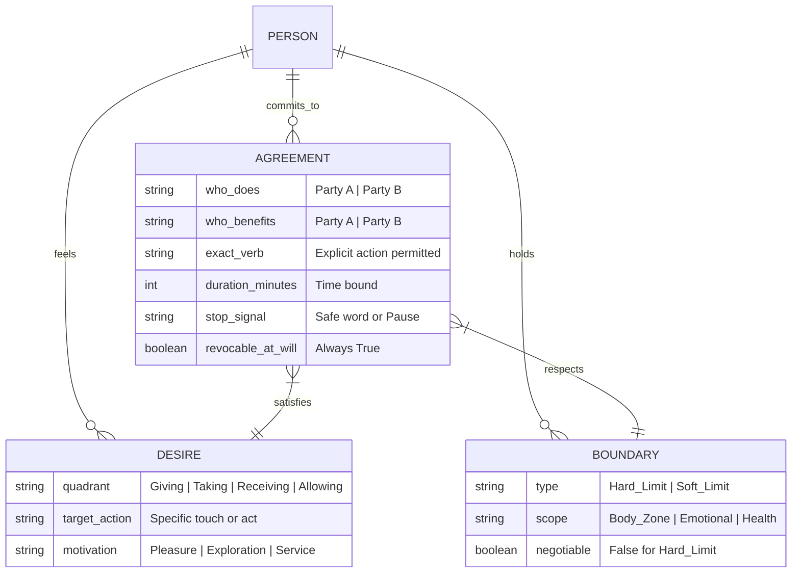

ISTA: International School of Temple Arts

[[Game - ISTA - Examples]]

The communication frameworks used in ISTA (International School of Temple Arts) and adjacent neo-tantra communities are primarily adapted from **Dr. Betty Martin’s [Wheel of Consent**](https://www.wheelofconsent.com), alongside the **3-Minute Game** and standard boundary containment models.


Every interaction requires answering two independent questions before contact begins:

1. **Who is doing the action?** (Active vs. Passive)
2. **Who is it for?** (Whose desire/pleasure drives the action?)

---

### The 4 Quadrants of Negotiation

```
                     WHO IS DOING?
                You                Me
         ┌─────────────────┬─────────────────┐
   You   │    RECEIVING    │     GIVING      │
W        │  "Will you...   │  "May I give... │
H        │   for me?"      │   for you?"     │
O   ─────┼─────────────────┼─────────────────┤
         │    ALLOWING     │     TAKING      │
F   Me   │  "You can...    │  "May I touch...│
O        │   for you."     │   for me?"      │
R        │                 │                 │
?        └─────────────────┴─────────────────┘

```

* **Giving (Serving):** I do it, but it’s for *your* pleasure.
* **Receiving (Accepting):** You do it, and it’s for *my* pleasure.
* **Taking (Seizing with Permission):** I do it for *my* pleasure, within your stated limits.
* **Allowing (Granting Access):** You do it for *your* pleasure, within my stated limits.

---

### Execution Runbook

```
[Phase 1: Calibration]
 ├── Check Internal State ("Want" vs "Willing" vs "Hard No")
 └── Clarify Non-Negotiables (STI status, barrier types, touch zones)
       │
[Phase 2: The Proposal]
 ├── State Request with Quadrant Clarity:
 │     ├── "I want to touch X for my pleasure. May I?" (Taking)
 │     └── "Would you like me to touch X for your pleasure?" (Giving)
 └── Set Explicit Constraints:
       ├── Action (exact touch/verb)
       ├── Location (exact body part)
       └── Timeframe (e.g., "for 3 minutes")
       │
[Phase 3: The Response]
 ├── Hell Yes   ──> Proceed to Execution
 ├── Hell No    ──> Stop. Do not counter-offer immediately.
 └── Counter    ──> Adjust scope (time, location, intensity)
       │
[Phase 4: Containment & Exit]
 ├── Real-Time Feedback ("Softer", "Slower", "Pause")
 ├── Revocation (Any "Stop" immediately reverts to zero touch)
 └── Debrief & Closure (Release agreements at time expiration)

```

---

### Consent & Agreement Data Architecture

To negotiate multi-layered boundaries without confusion, the protocol separates desire from the active contract:



---

### Reference Links

* **Foundational Framework:** [Wheel of Consent / School of Consent](https://www.wheelofconsent.com)
* **Creator Source & Practice:** [Betty Martin's The 3-Minute Game](https://www.google.com/search?q=https://bettymartin.org/how-to-play-the-3-minute-game/)
* **Organization Context:** [ISTA Official Portal](https://www.google.com/search?q=https://ista.institute/)

Are you looking to apply this framework to interpersonal dating, kink/play party dynamics, or long-term partner boundary setting?